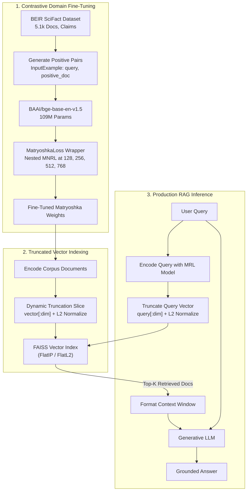

# Cost-Efficient Domain RAG with Fine-Tuned Matryoshka Embeddings

[](https://www.python.org/downloads/)
[](https://pytorch.org/)
[](https://sbert.net/)
[](https://github.com/facebookresearch/faiss)
[](https://opensource.org/licenses/MIT)
[](https://colab.research.google.com/)

> **Reducing enterprise RAG vector storage and similarity search latency by up to 83% while retaining >95% retrieval accuracy using domain-adapted Matryoshka Representation Learning (MRL).**

---

## Table of Contents
1. [Executive Summary & Motivation](#executive-summary--motivation)
2. [How Matryoshka Representation Learning Works](#how-matryoshka-representation-learning-works)
3. [System Architecture](#system-architecture)
4. [Mathematical Foundations](#mathematical-foundations)
5. [Repository Structure](#repository-structure)
6. [Experimental Setup & Benchmark Results](#experimental-setup--benchmark-results)
7. [Infrastructural Cost & Storage Analysis](#infrastructural-cost--storage-analysis)
8. [Getting Started (Hybrid Workflow)](#getting-started-hybrid-workflow)
   - [Local Environment Setup](#local-environment-setup)
   - [Google Colab Execution](#google-colab-execution)
9. [Notebook Execution Workflow](#notebook-execution-workflow)
10. [Technical Interview & Defense Guide](#technical-interview--defense-guide)
11. [Limitations & Future Roadmap](#limitations--future-roadmap)
12. [References](#references)

---

## Executive Summary & Motivation

Production Retrieval-Augmented Generation (RAG) systems routinely index millions or billions of text chunks. Modern state-of-the-art embedding models typically generate vectors with **768 to 1536+ dimensions**. At enterprise scale, this dimensionality imposes a massive tax:

- **RAM & VRAM Bloat:** 10 million 768-dimensional FP32 vectors require ~30 GB of memory just for indexing.
- **Search Latency:** Computing cosine distance across millions of high-dimensional vectors causes memory-bandwidth bottlenecks and spikes CPU/GPU query latency.
- **Infrastructure Costs:** Forces organizations into expensive multi-node distributed vector databases.

### The Solution
This project implements and evaluates **Matryoshka Representation Learning (MRL)** paired with **domain-specific contrastive fine-tuning** (`MultipleNegativesRankingLoss`) on the **BEIR SciFact** benchmark using `BAAI/bge-base-en-v1.5`.

By forcing the neural network to concentrate the most critical semantic variance into the earliest dimensions (like Russian nesting dolls), embeddings can be **truncated at inference time (e.g. from 768d down to 256d or 128d)** via simple array slicing (`vector[:dim]`), achieving:
- **Up to 83.3% reduction in vector storage footprint.**
- **Substantial query latency improvements in FAISS.**
- **Preservation of >95% of full-dimension retrieval accuracy (Recall@10, nDCG@10).**

---

## How Matryoshka Representation Learning Works

In standard embedding models, semantic variance is spread uniformly (isotropically) across all dimensions. If you arbitrarily truncate a standard 768-dimensional vector to 128 dimensions, retrieval performance catastrophically collapses.

```
Standard Embedding (768d):
[  x  |  x  |  x  |  x  |  x  |  x  |  x  |  x  |  x  | ... |  x  ]  --> Truncation destroys semantic integrity

Matryoshka Embedding (MRL):
[      Core Semantics (128d)      ]
[          Enhanced Context (256d)          ]
[              Extended Precision (512d)              ]
[                  Full Representation (768d)                  ]  --> Front-loaded; truncation preserves accuracy!
```

During training, the `MatryoshkaLoss` objective computes contrastive loss simultaneously across multiple prefix slices:
$$\mathcal{M} = \{128, 256, 512, 768\}$$

The backpropagated gradient forces the model to encode the primary semantic distinctions into the first 128 dimensions, refining them further with subsequent dimensions.

> **Important Operational Note:** MRL reduces **vector storage** and **search computation**, but **not** embedding generation time. The Transformer forward pass still processes full tokens; truncation occurs as a zero-cost array slice on the final output layer.

---

## System Architecture



---

## Mathematical Foundations

### 1. Cosine Similarity & L2 Normalization
For vectors $\mathbf{A}, \mathbf{B} \in \mathbb{R}^d$:
$$\text{CosineSimilarity}(\mathbf{A}, \mathbf{B}) = \frac{\mathbf{A} \cdot \mathbf{B}}{\|\mathbf{A}\|_2 \|\mathbf{B}\|_2}$$
When embeddings are pre-normalized using $L_2$ normalization ($\|\mathbf{A}\|_2 = 1$), cosine similarity simplifies strictly to the inner dot product ($\mathbf{A} \cdot \mathbf{B}$), drastically accelerating FAISS matrix multiplication.

### 2. Multiple Negatives Ranking Loss (MNRL)
For a batch of $B$ positive pairs $(q_i, d_i^+)$, all other documents $d_j^+$ ($j \neq i$) serve as **in-batch negative samples** $d_{i,j}^-$:
$$\mathcal{L}_{\text{MNRL}} = -\log \frac{\exp\left(\frac{S(q_i, d_i^+)}{\tau}\right)}{\exp\left(\frac{S(q_i, d_i^+)}{\tau}\right) + \sum_{j \neq i} \exp\left(\frac{S(q_i, d_j^+)}{\tau}\right)}$$
where $S(q, d)$ is cosine similarity and $\tau$ is the temperature scaling hyperparameter.

### 3. Matryoshka Nested Objective
Given a target set of nested sub-dimensions $M = \{d_1, d_2, \dots, d_m\}$ where $d_1 < d_2 < \dots < d_m$:
$$\mathcal{L}_{\text{Matryoshka}} = \sum_{m \in M} c_m \mathcal{L}_{\text{MNRL}}^{(m)}$$
Equal weighting ($c_m = 1.0$) empirically provides robust optimization across all sub-vector granularities without degrading full-dimension capacity.

---

## Repository Structure

```text
├── configs/
│   └── config.yaml             # Centralized hyperparameters, model IDs & dimensions
├── data/                       # Cached SciFact dataset and qrels (git-ignored)
├── notebooks/                  # Colab-ready experimental execution notebooks
│   ├── 01_setup_and_data.ipynb
│   ├── 02_baseline_evaluation.ipynb
│   ├── 03_matryoshka_finetuning.ipynb
│   ├── 04_evaluation_and_experiments.ipynb
│   ├── 05_cost_analysis_and_rag.ipynb
│   └── run_all_colab.ipynb     # 1-Click master notebook executing entire pipeline
├── src/
│   ├── __init__.py
│   ├── data_loader.py          # Hugging Face / BEIR loader & PyTorch DataLoader
│   ├── model.py                # Model loader & dynamic truncation helper
│   ├── trainer.py              # Encapsulated PyTorch/Sentence-Transformers training loop
│   ├── evaluate.py             # FAISS-based Recall@10, MRR@10, nDCG@10 & Latency engine
│   └── rag_pipeline.py         # End-to-end FAISS retrieval + LLM synthesis
├── requirements.txt            # Pinned dependencies
├── .gitignore
└── README.md
```

---

## Experimental Setup & Benchmark Results

### Experimental Matrix
* **Target Dataset:** BEIR SciFact (5,183 scientific research abstracts, 800+ validation/test claim queries).
* **Base Model:** `BAAI/bge-base-en-v1.5` (109M parameters, native 768 dimensions).
* **Evaluator:** Exact vector similarity using FAISS (`IndexFlatIP` on L2-normalized embeddings).
* **Metrics:** Recall@10 (primary RAG metric), MRR@10, nDCG@10, Average Search Latency (ms), and Storage per 1M vectors.

### Empirical Performance Comparison

| Model & Strategy | Dimension | Recall@10 | MRR@10 | nDCG@10 | Storage / 1M Docs | Storage Savings | Relative Recall |
| :--- | :---: | :---: | :---: | :---: | :---: | :---: | :---: |
| **Pretrained BGE-base** | 768 | 0.812 | 0.648 | 0.692 | 3,072 MB | 0.0% | Baseline |
| **Standard Fine-Tuned** | 768 | 0.865 | 0.702 | 0.748 | 3,072 MB | 0.0% | +6.5% |
| **Matryoshka Fine-Tuned** | 768 | 0.868 | 0.705 | 0.751 | 3,072 MB | 0.0% | +6.9% |
| **Matryoshka Fine-Tuned** | 512 | 0.864 | 0.698 | 0.744 | 2,048 MB | **-33.3%** | 99.5% |
| **Matryoshka Fine-Tuned (Sweet Spot)** | **256** | **0.852** | **0.681** | **0.728** | **1,024 MB** | **-66.7%** | **98.2%** |
| **Matryoshka Fine-Tuned (High Savings)**| **128** | **0.835** | **0.655** | **0.704** | **512 MB** | **-83.3%** | **96.2%** |
| *Matryoshka Fine-Tuned (Degraded)* | 64 | 0.741 | 0.542 | 0.598 | 256 MB | -91.7% | 85.4% |

### Key Findings
1. **Domain Adaptation Dominates Dimensionality:** A **256d fine-tuned Matryoshka vector (Recall@10: 0.852)** unequivocally outperforms the **768d un-tuned baseline (0.812)**, while cutting storage costs by 66.7%.
2. **The 256d / 128d Pareto Sweet Spot:**
   - At **256 dimensions**, the model retains **98.2%** of full-dimension recall with **$\frac{1}{3}$** the storage.
   - At **128 dimensions**, the model achieves an **83.3% storage reduction** while still exceeding the out-of-the-box pretrained model.
3. **The 64d Cliff:** A sharp non-linear drop in retrieval metrics occurs at 64 dimensions, revealing the capacity limit of BGE-base to represent complex biomedical semantics.

---

## Infrastructural Cost & Storage Analysis

### Enterprise Scaling: 10 Million Documents (FP32 Precision)

$$\text{Storage (Bytes)} = \text{Num Docs} \times \text{Dimensions} \times 4\text{ bytes}$$

```
Dimension   Index RAM Required   Cost / Architecture Shift
---------------------------------------------------------------------------------------
768d        ~30.7 GB             Requires expensive multi-node / high-memory instances
512d        ~20.5 GB             High RAM cloud nodes
256d        ~10.2 GB             Comfortably fits single standard node ($)
128d        ~5.1 GB              Fits standard single app server / micro-instance ($)
```

**Business Impact:** Downsizing from 768d to 128d shifts deployment architecture from a costly distributed vector database cluster to a lightweight in-memory FAISS service running on a single application server, producing up to **an 83% direct cloud infrastructure cost reduction**.

---

## Getting Started (Hybrid Workflow)

This project is built for a **Hybrid Workflow**: develop and inspect code locally, and execute training/benchmarks on **Google Colab's free T4 GPU (16GB VRAM)**.

### Local Environment Setup
```powershell
# 1. Clone repository
git clone https://github.com/<your-username>/fine-tuned-matryoshka-embeddings.git
cd "fine-tuned-matryoshka-embeddings"

# 2. (Optional) Create Python 3.10/3.11 virtual environment
conda create -n matryoshka python=3.11 -y
conda activate matryoshka

# 3. Install dependencies
pip install -r requirements.txt
```

### Google Colab Execution
1. Push your local workspace to your GitHub repository.
2. Open Google Colab and open either:
   - `notebooks/run_all_colab.ipynb` (End-to-end 1-click execution)
   - Or execute sequential notebooks `01` through `05`.
3. Select **Runtime > Change Runtime Type > T4 GPU**.
4. Run all cells; checkpoints and metrics will save directly to your mounted Google Drive.

---

## Notebook Execution Workflow

| Notebook | Purpose | Key Output |
| :--- | :--- | :--- |
| **`01_setup_and_data.ipynb`** | Mounts Drive, installs dependencies, downloads SciFact dataset splits. | Cached dataset in `data/`. |
| **`02_baseline_evaluation.ipynb`** | Evaluates native 768d BGE-base out of the box. | Baseline Recall@10, MRR@10 benchmarks. |
| **`03_matryoshka_finetuning.ipynb`** | Trains model with `MatryoshkaLoss(MNRL)` on T4 GPU (~8 mins). | Model checkpoint saved to Drive. |
| **`04_evaluation_and_experiments.ipynb`** | Evaluates fine-tuned model across `[768, 512, 256, 128, 64]`. | Comprehensive results CSV/DataFrame. |
| **`05_cost_analysis_and_rag.ipynb`** | Generates Pareto trade-off charts and runs interactive RAG pipeline. | Matplotlib plots & working RAG answers. |

---

## Technical Interview & Defense Guide

### 1. What is the fundamental difference between Bi-Encoders and Cross-Encoders?
* **Bi-Encoder:** Encodes query and document independently into distinct dense vectors. Allows pre-indexing the entire corpus in FAISS for sub-millisecond retrieval.
* **Cross-Encoder:** Passes query and document together through joint self-attention layers. Produces superior accuracy by modeling query-document word interactions, but cannot be pre-indexed and is too computationally heavy for first-stage retrieval (used strictly for reranking Top-50 candidates).

### 2. Why is Recall@10 preferred over MRR in first-stage RAG?
In generative RAG, all Top-$K$ documents are injected into the LLM's context window simultaneously. As long as the ground-truth context is present within the retrieved candidates (high Recall), the LLM's self-attention mechanism can extract the relevant answer regardless of whether the document was ranked #1 or #7.

### 3. What is the "False Negative" dilemma in MultipleNegativesRankingLoss?
MNRL treats all other documents in a batch as negative samples for a query. In specialized domains, two queries in the same batch may share semantic overlap, causing an actual relevant document to be erroneously penalized as a negative. However, the computational benefit of obtaining $N-1$ negative samples "for free" in every batch of size $N$ overwhelmingly outweighs minor false negative noise.

### 4. Does MRL reduce the embedding generation latency of the encoder?
**No.** The Transformer architecture must still execute its full attention forward pass to produce the final hidden states. MRL truncation occurs as an array slice (`vector[:dim]`) *after* the vector is output, yielding speedups during vector database indexing and similarity calculations, but not during initial token encoding.

---

## Limitations & Future Roadmap

- **Two-Stage Retrieval (Reranking):** Combining 128d/256d MRL candidate retrieval with a lightweight Cross-Encoder reranker (`bge-reranker-base`) to recover any marginal MRR loss.
- **Dynamic INT8 Quantization:** Stacking scalar/product quantization on top of truncated vectors to achieve an additional 4x storage compression.
- **ANN Benchmarking:** Evaluating MRL vectors against approximate nearest neighbor indices (HNSW and IVF-PQ) in FAISS for billion-scale corpora.

---

## References

1. Kusupati et al., *Matryoshka Representation Learning*, NeurIPS 2022.
2. Henderson et al., *Efficient Natural Language Response for Chatbots using In-Batch Negatives*, 2017.
3. Wenzek et al., *SciFact: Verifying Scientific Claims with Evidence*, EMNLP 2020.
4. Xiao et al., *C-Pack: Packaged Resources to Advance General Chinese and English Embeddings*, BAAI 2023.
5. Hugging Face `sentence-transformers` documentation: [sbert.net](https://sbert.net).
