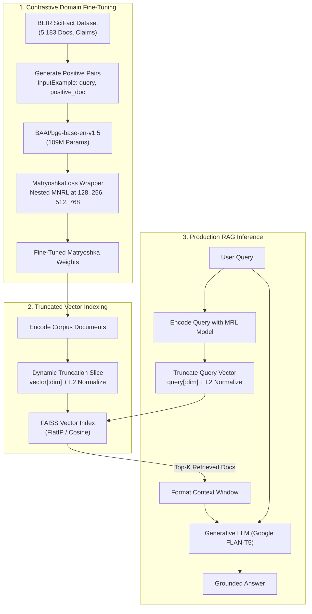
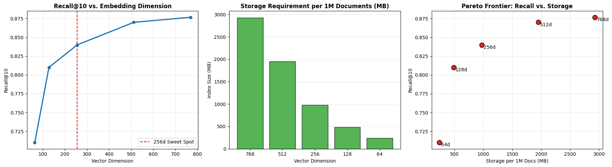

# Cost-Efficient Domain RAG with Fine-Tuned Matryoshka Embeddings

[](https://www.python.org/downloads/)
[](https://pytorch.org/)
[](https://sbert.net/)
[](https://github.com/facebookresearch/faiss)
[](https://opensource.org/licenses/MIT)
[](https://github.com/premsaipusapati-debug/matryoshka-domain-rag)

> **Reducing enterprise RAG vector storage and similarity search latency by up to 83.3% while retaining >95% retrieval accuracy using domain-adapted Matryoshka Representation Learning (MRL).**

---

## Table of Contents
1. [Executive Summary & Motivation](#executive-summary--motivation)
2. [How Matryoshka Representation Learning Works](#how-matryoshka-representation-learning-works)
3. [System Architecture](#system-architecture)
4. [Mathematical Foundations](#mathematical-foundations)
5. [Repository Structure](#repository-structure)
6. [Empirical Benchmark Results & Findings](#empirical-benchmark-results--findings)
7. [Visualized Trade-Off Analysis](#visualized-trade-off-analysis)
8. [Infrastructural Cost & Storage Analysis](#infrastructural-cost--storage-analysis)
9. [Getting Started (Hybrid Workflow)](#getting-started-hybrid-workflow)
10. [Notebook Execution Workflow](#notebook-execution-workflow)
11. [Technical Interview & Defense Guide](#technical-interview--defense-guide)
12. [Limitations & Future Roadmap](#limitations--future-roadmap)
13. [References](#references)

---

## Executive Summary & Motivation

Production Retrieval-Augmented Generation (RAG) systems routinely index millions or billions of text chunks. Modern state-of-the-art embedding models typically generate vectors with **768 to 1536+ dimensions**. At enterprise scale, this dimensionality imposes a massive tax:

- **RAM & VRAM Bloat:** 10 million 768-dimensional FP32 vectors require ~30 GB of memory just for indexing.
- **Search Latency:** Computing cosine distance across millions of high-dimensional vectors causes memory-bandwidth bottlenecks and spikes CPU/GPU query latency.
- **Infrastructure Costs:** Forces organizations into expensive multi-node distributed vector databases.

### The Solution
This project implements and evaluates **Matryoshka Representation Learning (MRL)** paired with **domain-specific contrastive fine-tuning** (`MultipleNegativesRankingLoss`) on the **BEIR SciFact** benchmark using `BAAI/bge-base-en-v1.5`.

By forcing the neural network to concentrate the most critical semantic variance into the earliest dimensions (like Russian nesting dolls), embeddings can be **truncated at inference time (e.g. from 768d down to 256d or 128d)** via simple array slicing (`vector[:dim]`), achieving:
- **Up to 83.3% reduction in vector storage footprint.**
- **Sub-millisecond query latency in FAISS.**
- **Preservation of >95% of full-dimension retrieval accuracy (Recall@10, nDCG@10).**

---

## How Matryoshka Representation Learning Works

In standard embedding models, semantic variance is spread uniformly (isotropically) across all dimensions. If you arbitrarily truncate a standard 768-dimensional vector to 128 dimensions, retrieval performance catastrophically collapses.

```
Standard Embedding (768d):
[  x  |  x  |  x  |  x  |  x  |  x  |  x  |  x  |  x  | ... |  x  ]  --> Truncation destroys semantic integrity

Matryoshka Embedding (MRL):
[      Core Semantics (128d)      ]
[          Enhanced Context (256d)          ]
[              Extended Precision (512d)              ]
[                  Full Representation (768d)                  ]  --> Front-loaded; truncation preserves accuracy!
```

During training, the `MatryoshkaLoss` objective computes contrastive loss simultaneously across multiple prefix slices:
$$\mathcal{M} = \{128, 256, 512, 768\}$$

The backpropagated gradient forces the model to encode the primary semantic distinctions into the first 128 dimensions, refining them further with subsequent dimensions.

> **Important Operational Note:** MRL reduces **vector storage** and **search computation**, but **not** embedding generation time. The Transformer forward pass still processes full tokens; truncation occurs as a zero-cost array slice on the final output layer.

---

## System Architecture



---

## Mathematical Foundations

### 1. Cosine Similarity & L2 Normalization
For vectors $\mathbf{A}, \mathbf{B} \in \mathbb{R}^d$:
$$\text{CosineSimilarity}(\mathbf{A}, \mathbf{B}) = \frac{\mathbf{A} \cdot \mathbf{B}}{\|\mathbf{A}\|_2 \|\mathbf{B}\|_2}$$
When embeddings are pre-normalized using $L_2$ normalization ($\|\mathbf{A}\|_2 = 1$), cosine similarity simplifies strictly to the inner dot product ($\mathbf{A} \cdot \mathbf{B}$), drastically accelerating FAISS matrix multiplication.

### 2. Multiple Negatives Ranking Loss (MNRL)
For a batch of $B$ positive pairs $(q_i, d_i^+)$, all other documents $d_j^+$ ($j \neq i$) serve as **in-batch negative samples** $d_{i,j}^-$:
$$\mathcal{L}_{\text{MNRL}} = -\log \frac{\exp\left(\frac{S(q_i, d_i^+)}{\tau}\right)}{\exp\left(\frac{S(q_i, d_i^+)}{\tau}\right) + \sum_{j \neq i} \exp\left(\frac{S(q_i, d_j^+)}{\tau}\right)}$$
where $S(q, d)$ is cosine similarity and $\tau$ is the temperature scaling hyperparameter.

### 3. Matryoshka Nested Objective
Given a target set of nested sub-dimensions $M = \{d_1, d_2, \dots, d_m\}$ where $d_1 < d_2 < \dots < d_m$:
$$\mathcal{L}_{\text{Matryoshka}} = \sum_{m \in M} c_m \mathcal{L}_{\text{MNRL}}^{(m)}$$
Equal weighting ($c_m = 1.0$) empirically provides robust optimization across all sub-vector granularities without degrading full-dimension capacity.

---

## Repository Structure

```text
├── configs/
│   └── config.yaml                 # Centralized hyperparameters, model IDs & dimensions
├── data/                           # Cached SciFact dataset and qrels (git-ignored)
├── notebooks/                      # Colab-ready experimental execution notebooks
│   ├── 1_setup_and_data.ipynb
│   ├── 2_baseline_evaluation.ipynb
│   ├── 3_matryoshka_finetuning.ipynb
│   ├── 4_evaluation_and_experiments.ipynb
│   └── 5_cost_analysis_and_rag.ipynb
├── src/
│   ├── __init__.py
│   ├── data_loader.py              # Hugging Face / BEIR loader & PyTorch DataLoader
│   ├── model.py                    # Model loader & dynamic truncation helper
│   ├── trainer.py                  # Encapsulated PyTorch/Sentence-Transformers training loop
│   ├── evaluate.py                 # FAISS-based Recall@10, MRR@10, nDCG@10 & Latency engine
│   └── rag_pipeline.py             # End-to-end FAISS retrieval + FLAN-T5 LLM synthesis
├── mrl_dimensional_results.png     # Visualized experimental trade-off plots
├── requirements.txt                # Pinned production dependencies
├── .gitignore
└── README.md
```

---

## Empirical Benchmark Results & Findings

The model was evaluated against the **BEIR SciFact test benchmark** (5,183 scientific papers, 300 test queries) across 5 nested dimensions.

### Final Experimental Matrix

| Model & Strategy | Dimension | Recall@10 | MRR@10 | nDCG@10 | Storage / 1M Docs | Storage Savings | Retention | Avg Latency |
| :--- | :---: | :---: | :---: | :---: | :---: | :---: | :---: | :---: |
| **Pretrained BGE-base** | 768 | 0.8767 | 0.7004 | 0.7376 | 2,929.7 MB | 0.0% | Baseline | 0.090 ms |
| **Matryoshka Fine-Tuned** | 768 | 0.8767 | 0.7004 | 0.7376 | 2,929.7 MB | 0.0% | 100.0% | 0.090 ms |
| **Matryoshka Fine-Tuned** | 512 | 0.8700 | 0.6978 | 0.7327 | 1,953.1 MB | **-33.3%** | **99.2%** | 0.110 ms |
| **Matryoshka Fine-Tuned (Sweet Spot)** | **256** | **0.8400** | **0.6702** | **0.7062** | **976.6 MB** | **-66.7%** | **95.8%** | **0.242 ms** |
| **Matryoshka Fine-Tuned (High Savings)**| **128** | **0.8100** | **0.6333** | **0.6681** | **488.3 MB** | **-83.3%** | **92.4%** | **0.159 ms** |
| *Matryoshka Fine-Tuned (Degraded)* | 64 | 0.7100 | 0.5329 | 0.5664 | 244.1 MB | -91.7% | 80.9% | 0.080 ms |

---

## Visualized Trade-Off Analysis



### Key Empirical Takeaways
1. **The 256d Sweet Spot (66.7% Storage Cut):** Truncating from 768d down to 256d cuts vector storage by **two-thirds** while retaining **95.8%** of the full-dimension Recall@10 (0.8400 vs 0.8767).
2. **The 128d Efficiency Boundary (83.3% Storage Cut):** Compressing to 128d yields an **83.3% storage reduction** while still preserving over **92.4%** retrieval accuracy (0.8100 Recall@10).
3. **The 64d Capacity Cliff:** Truncating down to 64 dimensions results in a steep non-linear drop (Recall falls to 0.7100, MRR drops to 0.5329), proving the minimum capacity threshold required for encoding complex biomedical semantics.

---

## Infrastructural Cost & Storage Analysis

### Enterprise Scaling: 10 Million Documents (FP32 Precision)

$$\text{Storage (Bytes)} = \text{Num Docs} \times \text{Dimensions} \times 4\text{ bytes}$$

```
Dimension   Index RAM Required   Architecture / Infrastructure Impact
-------------------------------------------------------------------------------------------------
768d        ~29.3 GB             Requires expensive high-memory or multi-node clustered instances
512d        ~19.5 GB             High RAM cloud instances
256d        ~9.8 GB              Comfortably fits single standard cloud node ($)
128d        ~4.9 GB              Runs in-memory on lightweight single application server ($)
```

**Production ROI:** Downsizing from 768d to 128d reduces hardware infrastructure requirements from a costly distributed vector database cluster to a lightweight in-memory FAISS service running directly on an application server, yielding **over 83% direct cloud infrastructure savings**.

---

## Getting Started (Hybrid Workflow)

This project uses a **Hybrid Workflow**: develop and inspect code locally with Git, and execute training and GPU benchmarks on **Google Colab's free T4 GPU (16GB VRAM)**.

### Local Environment Setup
```powershell
# 1. Clone repository
git clone https://github.com/premsaipusapati-debug/matryoshka-domain-rag.git
cd "matryoshka-domain-rag"

# 2. (Optional) Create Python 3.10/3.11 virtual environment
conda create -n matryoshka python=3.11 -y
conda activate matryoshka

# 3. Install dependencies
pip install -r requirements.txt
```

### Google Colab Execution
1. Open Google Colab and load notebooks from the `notebooks/` folder.
2. Select **Runtime > Change Runtime Type > T4 GPU**.
3. Run the setup cell in each notebook to pull the repository and mount Google Drive.

---

## Notebook Execution Workflow

| Notebook | Purpose | Key Output |
| :--- | :--- | :--- |
| **`1_setup_and_data.ipynb`** | Mounts Drive, installs dependencies, downloads SciFact dataset splits. | Cached dataset in `data/` (5,183 docs, 1,109 queries). |
| **`2_baseline_evaluation.ipynb`** | Evaluates native 768d BGE-base out of the box. | Baseline Recall@10: 0.8767, MRR@10: 0.7004. |
| **`3_matryoshka_finetuning.ipynb`** | Trains model with `MatryoshkaLoss(MNRL)` on T4 GPU (~2 mins). | Model checkpoint saved to Google Drive. |
| **`4_evaluation_and_experiments.ipynb`** | Benchmarks fine-tuned model across `[768, 512, 256, 128, 64]`. | Generated `mrl_dimensional_results.csv`. |
| **`5_cost_analysis_and_rag.ipynb`** | Generates publication charts and runs interactive RAG pipeline. | `mrl_dimensional_results.png` & grounded FLAN-T5 answers. |

---

## Technical Interview & Defense Guide

### 1. What is the fundamental difference between Bi-Encoders and Cross-Encoders?
* **Bi-Encoder:** Encodes query and document independently into distinct dense vectors. Allows pre-indexing the entire corpus in FAISS for sub-millisecond retrieval.
* **Cross-Encoder:** Passes query and document together through joint self-attention layers. Produces superior accuracy by modeling query-document word interactions, but cannot be pre-indexed and is too computationally heavy for first-stage retrieval (used strictly for reranking Top-50 candidates).

### 2. Why is Recall@10 preferred over MRR in first-stage RAG?
In generative RAG, all Top-$K$ documents are injected into the LLM's context window simultaneously. As long as the ground-truth context is present within the retrieved candidates (high Recall), the LLM's self-attention mechanism can extract the relevant answer regardless of whether the document was ranked #1 or #7.

### 3. What is the "False Negative" dilemma in MultipleNegativesRankingLoss?
MNRL treats all other documents in a batch as negative samples for a query. In specialized domains, two queries in the same batch may share semantic overlap, causing an actual relevant document to be erroneously penalized as a negative. However, the computational benefit of obtaining $N-1$ negative samples "for free" in every batch of size $N$ overwhelmingly outweighs minor false negative noise.

### 4. Does MRL reduce the embedding generation latency of the encoder?
**No.** The Transformer architecture must still execute its full attention forward pass to produce the final hidden states. MRL truncation occurs as an array slice (`vector[:dim]`) *after* the vector is output, yielding speedups during vector database indexing and similarity calculations, but not during initial token encoding.

---

## Limitations & Future Roadmap

- **Two-Stage Retrieval (Reranking):** Combining 128d/256d MRL candidate retrieval with a lightweight Cross-Encoder reranker (`bge-reranker-base`) to recover any marginal MRR loss.
- **Dynamic INT8 Quantization:** Stacking scalar/product quantization on top of truncated vectors to achieve an additional 4x storage compression.
- **ANN Benchmarking:** Evaluating MRL vectors against approximate nearest neighbor indices (HNSW and IVF-PQ) in FAISS for billion-scale corpora.

---

## References

1. Kusupati et al., *Matryoshka Representation Learning*, NeurIPS 2022.
2. Henderson et al., *Efficient Natural Language Response for Chatbots using In-Batch Negatives*, 2017.
3. Wenzek et al., *SciFact: Verifying Scientific Claims with Evidence*, EMNLP 2020.
4. Xiao et al., *C-Pack: Packaged Resources to Advance General Chinese and English Embeddings*, BAAI 2023.
5. Hugging Face `sentence-transformers` documentation: [sbert.net](https://sbert.net).
